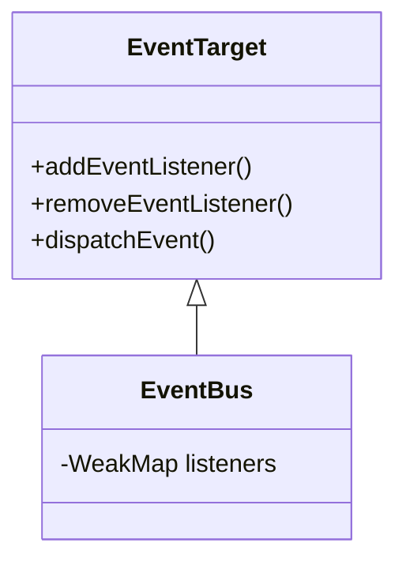

## Getting started

To install the event-bus into your project, simply run

```bash
npm install @vanillaspa/event-bus
```

## How-To

Now integrate the event-bus into your app: 

```javascript
<script type="module">
  import * as eventbus from '@vanillaspa/event-bus';
  window.eventbus = eventbus;
</script>
```

This is only a recommendation. You can use it however you like. With the `eventbus` object attached to the `window` object, you have access to the event-bus in your WebComponents.

Then simply use `eventbus.addEventListener(type, listener)` and `eventbus.dispatchEvent(event)` in your WebComponents.

You are not bound to event bubbling or capturing, which are the standard event propagation mechanisms, but now you can send events even among any objects!

```javascript
eventbus.addEventListener("click", () => {console.log("click")}, window);
eventbus.dispatchEvent(new Event("click"), window);
```

## EventBus API architecture




That's it. Check it out! KISS

## Contribute

Please give your warm feedback.